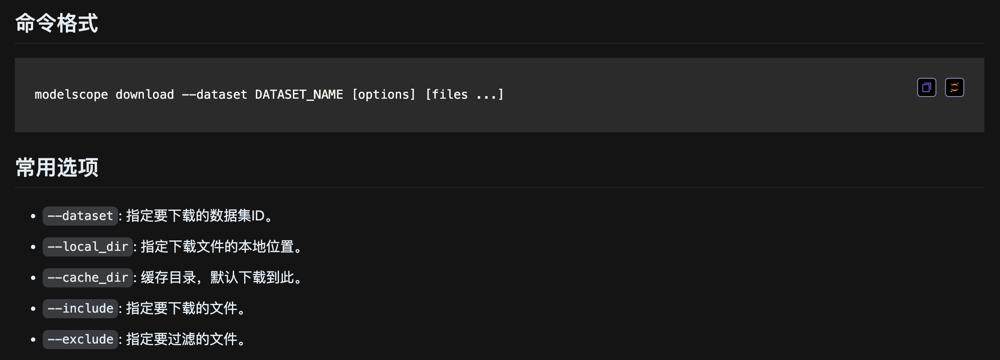

# 从ModelScope上下载模型或数据集

```{bash}
python -m pip install modelscope
modelscope download --dataset iic/Loong
modelscope download --dataset iic/Loong README.md --local_dir ./dir
```



(API文档：[链接](https://www.modelscope.cn/docs/datasets/download#3-%E4%BD%BF%E7%94%A8%E5%91%BD%E4%BB%A4%E8%A1%8C%E5%B7%A5%E5%85%B7%E4%B8%8B%E8%BD%BD%E6%95%B0%E6%8D%AE%E9%9B%86%E6%96%87%E4%BB%B6))